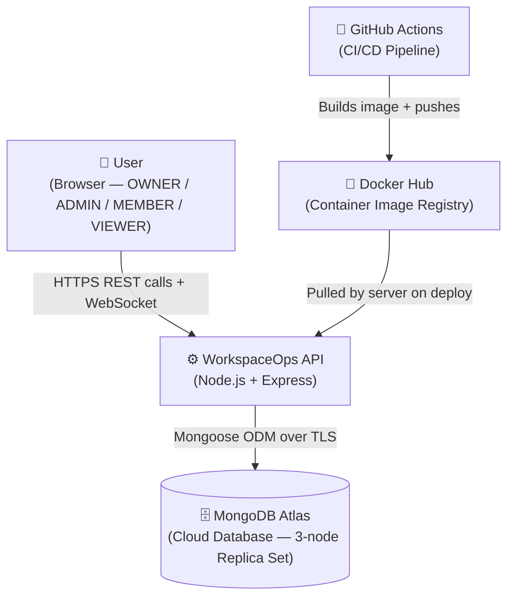
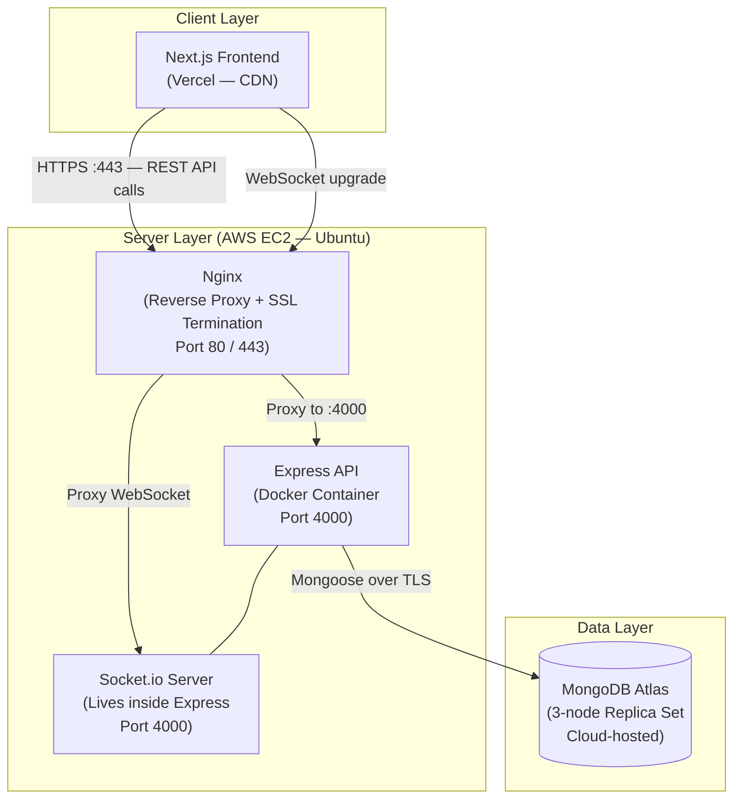
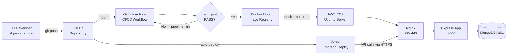

# High Level Design (HLD) — WorkspaceOps Backend

> **Document Type:** High Level Design
> **Version:** 1.0.0
> **Status:** Complete
> **Related Docs:** [FRD](./FRD%20WorkspaceOps.pdf) · [HLR List](./HLR%20list%20for%20Workspace%20Ops.pdf) · [Clean Architecture Detail](./clean_architecture_design.md) · [Technical Decisions](./technical_decisions.md) · [API Documentation](../API_DOCUMENTATION.md)

---

## Table of Contents

1. [System Overview](#1-system-overview)
2. [Tech Stack](#2-tech-stack)
3. [C4 Level 1 — System Context](#3-c4-level-1--system-context)
4. [C4 Level 2 — Container Architecture](#4-c4-level-2--container-architecture)
5. [Deployment Topology](#5-deployment-topology)
6. [Clean Architecture Pattern](#6-clean-architecture-pattern)
7. [Module Overview](#7-module-overview)
8. [Key Design Decisions](#8-key-design-decisions)
9. [Communication Patterns](#9-communication-patterns)
10. [Security Architecture](#10-security-architecture)
11. [Request Lifecycle](#11-request-lifecycle)
12. [Testing Strategy](#12-testing-strategy)

---

## 1. System Overview

WorkspaceOps is a **multi-tenant workspace management platform** built as a SaaS backend. It allows teams to create isolated workspaces, manage entities (customers, employees, vendors), track documents with expiry monitoring, and manage work items — all with role-based access control.

**Core capabilities:**
- Multi-tenant isolation: each workspace has its own data, members, and roles
- Entity management: define and track real-world entities within a workspace
- Document management: upload documents, track expiry status (VALID / EXPIRING_SOON / EXPIRED)
- Work item tracking: DRAFT → ACTIVE → COMPLETED state machine with document linking
- Audit logging: every write operation is recorded as a cross-cutting concern
- Dashboard overview: aggregated counts across entities, documents, and work items
- Real-time updates: Socket.io events on mutations

**Scope:** This document covers the backend API only. Frontend is a separate Next.js application deployed on Vercel.

---

## 2. Tech Stack

| Technology | Version | Purpose |
|---|---|---|
| **Node.js** | 20.x LTS | JavaScript runtime |
| **Express.js** | 5.2.1 | HTTP server framework |
| **TypeScript** | 5.9.3 | Type safety, compile-time error catching |
| **MongoDB** | 7.x (Atlas) | Primary database — document store |
| **Mongoose** | 9.1.5 | ODM — schema definition, query building |
| **JSON Web Token** | 9.0.3 | Stateless authentication tokens |
| **bcrypt** | 6.0.0 | Password hashing (cost factor 10) |
| **Socket.io** | 4.8.3 | Real-time bidirectional event system |
| **Multer** | 2.0.2 | File upload handling (multipart/form-data) |
| **express-rate-limit** | 8.3.1 | Rate limiting (brute-force protection) |
| **compression** | 1.8.1 | Gzip response compression |
| **swagger-ui-express** | 5.0.1 | Interactive API documentation at `/api-docs` |
| **Docker** | 24.x | Containerisation for consistent deployment |
| **Jest** | 29.7.0 | Unit and integration testing |
| **Supertest** | 7.2.2 | HTTP integration test client |
| **mongodb-memory-server** | 11.0.1 | In-memory MongoDB for isolated tests |
| **ts-node-dev** | 2.0.0 | Hot-reload dev server |
| **ESLint + Prettier** | 9.x / 3.x | Linting and code formatting |

---

## 3. C4 Level 1 — System Context

> **What this diagram shows:** The entire system treated as a single black box. Who uses it? What external systems does it depend on?



**Actors and systems:**

| Actor / System | Role |
|---|---|
| **User (Browser)** | Authenticated human using the app. Has one of 4 roles per workspace: OWNER, ADMIN, MEMBER, VIEWER |
| **WorkspaceOps API** | The backend — handles all business logic, authentication, data persistence, and real-time events |
| **MongoDB Atlas** | Cloud-hosted MongoDB. 3-node replica set enables ACID transactions (required for multi-collection writes) |
| **GitHub Actions** | CI/CD pipeline — runs TypeScript checks + Jest tests, then builds and pushes Docker image |
| **Docker Hub** | Stores versioned Docker images. Production server pulls from here on each deploy |

---

## 4. C4 Level 2 — Container Architecture

> **What this diagram shows:** The major deployable units (containers) inside the system and how they communicate.



**Container responsibilities:**

| Container | Technology | Responsibility |
|---|---|---|
| **Next.js Frontend** | Next.js + React, Vercel | UI — calls the REST API and connects via WebSocket |
| **Nginx** | Nginx on EC2 | Terminates SSL (HTTPS), reverse-proxies to Express on port 4000 |
| **Express API** | Node.js + Express in Docker | All business logic — REST endpoints, authentication, RBAC, data access |
| **Socket.io Server** | socket.io, runs inside Express process | Real-time events — emits workspace-scoped events on every mutation |
| **MongoDB Atlas** | MongoDB 7.x, 3-node replica set | Persistent storage — documents, users, workspaces, entities, work items |

---

## 5. Deployment Topology

> **What this diagram shows:** How code goes from a developer's machine to production.



**Key points:**
- Backend and frontend are in **separate repositories** — independent CI/CD pipelines
- Every push to `main` triggers the pipeline: TypeScript check → Jest tests → Docker build → push → SSH into EC2 → pull + restart container
- **Nginx handles SSL termination** — the Express app always receives plain HTTP internally (no TLS in app code)
- MongoDB Atlas is accessed via a connection string with TLS — never exposed to the public internet

---

## 6. Clean Architecture Pattern

> **What this is:** A structural pattern that separates code into 4 concentric layers. The core rule: **dependencies only point inward**. Business logic never imports HTTP or database code.

```
Infrastructure → Interfaces → Application → Domain
(Express/Mongoose)  (Controllers)  (Use Cases)  (Pure Business Logic)
      ↑                 ↑               ↑              ↑
  outermost          framework       orchestrates    no dependencies
  layer              aware           use cases       at all
```

**The 4 layers in this project:**

| Layer | Contains | Depends On | Example Class |
|---|---|---|---|
| **Domain** | Entities, Interfaces (repository contracts), Value Objects, business rules | Nothing (pure TypeScript) | `User.ts`, `IUserRepository.ts`, `Email.ts` |
| **Application** | Use Cases (one class per operation), DTOs | Domain only | `CreateDocumentUseCase.ts`, `InviteMemberUseCase.ts` |
| **Interfaces** | HTTP Controllers, route handlers, request/response mapping | Application + Domain | `DocumentController.ts`, `authMiddleware.ts` |
| **Infrastructure** | Mongoose models, repository implementations, S3 client, route wiring, DI | All layers | `MongoDocumentRepository.ts`, `document.routes.ts` |

**Why this matters:**
- Every Use Case is testable without a running database — inject a mock repository
- Express can be swapped for Fastify by changing only the Interfaces layer
- MongoDB can be swapped for PostgreSQL by changing only the Infrastructure layer
- Business rules live in one place — no hunting through controllers to find validation logic

---

## 7. Module Overview

The API is divided into **8 feature modules**. Each module is self-contained with its own domain → application → interfaces → infrastructure layers.

| Module | Responsibility | Base Route | Key Operations |
|---|---|---|---|
| **auth** | User registration, login, JWT token issuance | `/auth` | `POST /register`, `POST /login` |
| **workspace** | Create workspaces, invite / remove members, update roles | `/workspaces` | CRUD workspaces, `POST /invite`, `DELETE /members/:userId` |
| **entity** | Manage entities (customers, employees, vendors) within a workspace | `/workspaces/:id/entities` | CRUD entities, list with count |
| **document-type** | Define document schemas — metadata fields, expiry rules | `/workspaces/:id/document-types` | CRUD document types, field definitions |
| **document** | Upload documents, track expiry, link to entities | `/workspaces/:id/documents` | CRUD documents, expiry status computed on read |
| **work-item** | Task/ticket tracking with a state machine, linked to documents | `/workspaces/:id/work-items` | CRUD work items, `PATCH /status`, link documents |
| **audit-log** | Record every write operation as a cross-cutting concern (fire-and-forget) | `/workspaces/:id/audit-logs` | `GET` audit logs with pagination |
| **overview** | Aggregated dashboard counts — entities, documents, work items by status | `/workspaces/:id/overview` | `GET` overview stats |

---

## 8. Key Design Decisions

Five decisions that define this system's architecture. Each has a "why" rooted in real trade-offs.

### 1. Clean Architecture over MVC
**Decision:** Four-layer Clean Architecture instead of a flat MVC structure.
**Why:** MVC tightly couples business logic to HTTP controllers and database models. When Express or Mongoose is upgraded (or replaced), you shouldn't have to touch business rules. Clean Architecture enforces a hard boundary — Use Cases contain business logic and know nothing about HTTP or MongoDB.
**Trade-off:** More files and boilerplate upfront. Worth it for testability and long-term maintainability.

### 2. MongoDB over PostgreSQL
**Decision:** MongoDB (Mongoose) as the primary database.
**Why:** Workspace data is naturally document-shaped. Each workspace has different document-type schemas (dynamic metadata fields defined at runtime). A relational schema would need a complex EAV (Entity-Attribute-Value) table or JSON columns. MongoDB natively stores nested documents.
**Trade-off:** No built-in foreign key constraints. Enforced at the application layer instead.

### 3. MongoDB Replica Set for ACID Transactions
**Decision:** Use MongoDB Atlas (3-node replica set) to enable multi-document transactions.
**Why:** Operations like "create workspace + add owner as member" must be atomic. If the workspace is created but the member insert fails, the database is in an inconsistent state. Transactions via replica sets prevent this.
**Trade-off:** Slightly higher cost and latency vs a standalone MongoDB instance.

### 4. Manual Dependency Injection over a DI Container
**Decision:** Wire dependencies manually in `*.routes.ts` files (e.g., `new MongoUserRepository()` passed to `new LoginUseCase(repo)`).
**Why:** A DI container (tsyringe, InversifyJS) adds complexity and decorator metadata that can confuse TypeScript beginners. For MVP scale (8 modules), manual wiring is explicit and fully visible — no magic.
**Trade-off:** Repetitive boilerplate in route files. Migrating to a DI container later is straightforward because interfaces are already defined.

### 5. Fire-and-Forget Audit Logging
**Decision:** Audit log writes are `async` but never `await`-ed in the calling use case.
**Why:** If audit logging is in the critical path of a write operation, a slow or failing audit log would cause the main operation to fail or slow down. Audit logs are observational — they should never affect the main business transaction.
**Trade-off:** In the rare case the audit log write fails, the log entry is lost. Acceptable for MVP; a message queue (Redis, SQS) would solve this at production scale.

---

## 9. Communication Patterns

### REST API

| Property | Value |
|---|---|
| **Base URL (dev)** | `http://localhost:4000` |
| **Base URL (prod)** | `https://api.yourdomain.com` |
| **Auth header** | `Authorization: Bearer <jwt_token>` |
| **Content-Type** | `application/json` (except file uploads: `multipart/form-data`) |
| **API docs** | `GET /api-docs` — Swagger UI |
| **Health check** | `GET /health` → `{ "status": "ok" }` |

**Response conventions by module** (intentionally inconsistent — consolidated here for frontend reference):

| Module | List Response Shape | Single Item Shape |
|---|---|---|
| entity | `{ entities: [...], count }` | `{ id, workspaceId, name, role }` |
| document-type | `{ documentTypes: [...], count }` | `{ success, data: { id, ... } }` |
| document | `{ documents: [...], count }` | `{ id, expiryStatus, downloadUrl, ... }` |
| work-item | `{ workItems: [...], count }` | `{ id, status, linkedDocumentIds[], ... }` |
| audit-log | `{ total, limit, offset, logs: [...] }` | — |
| overview | `{ workspaceId, entities: {...}, documents: {...}, workItems: {...} }` | — |

### WebSocket (Socket.io)

Socket.io runs on the same port as the Express server (4000). Clients connect and join workspace-scoped rooms.

| Event | Emitted When | Payload |
|---|---|---|
| `entity:created` | New entity added to workspace | `{ workspaceId, entity }` |
| `entity:updated` | Entity updated | `{ workspaceId, entity }` |
| `entity:deleted` | Entity deleted | `{ workspaceId, entityId }` |
| `document:created` | New document uploaded | `{ workspaceId, document }` |
| `document:updated` | Document updated | `{ workspaceId, document }` |
| `workItem:created` | New work item created | `{ workspaceId, workItem }` |
| `workItem:statusChanged` | Work item status updated | `{ workspaceId, workItemId, newStatus }` |

---

## 10. Security Architecture

### Authentication — JWT Flow

```
1. Client         POST /auth/login  { email, password }
       ↓
2. API            Validates credentials → bcrypt.compare(password, hash)
       ↓
3. API            Signs JWT: jwt.sign({ userId, email }, JWT_SECRET, { expiresIn: '24h' })
       ↓
4. Client         Stores token (memory or localStorage)
       ↓
5. Client         Every request: Authorization: Bearer <token>
       ↓
6. authMiddleware  jwt.verify(token, JWT_SECRET) → attaches req.user = { userId, email }
       ↓
7. Controller     req.user is available — no DB call needed for identity
```

**Token properties:**
- Expiry: 24 hours
- Algorithm: HS256 (HMAC-SHA256)
- Payload: `{ userId, email, iat, exp }`
- Secret: stored in `.env` as `JWT_SECRET` — never in code

### Authorisation — RBAC

Each user has a **per-workspace role**. The same user can be OWNER in Workspace A and MEMBER in Workspace B.

| Role | Capabilities |
|---|---|
| **OWNER** | Full access — delete workspace, manage all members, all CRUD |
| **ADMIN** | Manage members below ADMIN level, all CRUD on workspace data |
| **MEMBER** | Read + write workspace data, cannot manage members |
| **VIEWER** | Read-only access |

**Middleware mapping:**

```typescript
requireOwner   // OWNER only              → used for: delete workspace, transfer ownership
requireAdmin   // OWNER + ADMIN           → used for: invite member, remove member, update roles
requireMember  // OWNER + ADMIN + MEMBER  → used for: create/update entities, documents, work items
// No middleware = public (login, register only)
```

The middleware reads `workspaceId` from `req.params` and checks the user's membership record in the database.

---

## 11. Request Lifecycle

A complete end-to-end trace of a typical authenticated, role-protected request:
**Example: `POST /workspaces/:workspaceId/documents` (create a document)**

```
Step 1   Browser
         Sends: POST /workspaces/abc123/documents
                Authorization: Bearer eyJhbGc...
                Content-Type: multipart/form-data
                Body: { entityId, documentTypeId, file }

Step 2   Nginx (production only)
         Terminates SSL (HTTPS → HTTP)
         Forwards to Express on :4000

Step 3   Express Middleware Stack
         cors() → compression() → express.json() → multer (file parsing)

Step 4   authMiddleware.ts
         Extracts Bearer token → jwt.verify() → attaches req.user = { userId, email }
         If invalid/expired → 401 Unauthorized (stops here)

Step 5   rbacMiddleware.ts (requireMember)
         Looks up WorkspaceMember record for { userId, workspaceId }
         Checks role is OWNER | ADMIN | MEMBER
         If not a member or role is VIEWER → 403 Forbidden (stops here)

Step 6   DocumentController.ts
         Extracts and validates request body (DTO)
         Calls: createDocumentUseCase.execute(dto)

Step 7   CreateDocumentUseCase.ts
         Validates business rules (entity exists, document type exists, required fields)
         Calls: documentRepository.create(document)
         Calls: auditLogService?.log(...) — fire-and-forget, does not await

Step 8   MongoDocumentRepository.ts
         Maps domain object to Mongoose model
         Calls: DocumentModel.create(...) → writes to MongoDB Atlas

Step 9   CreateDocumentUseCase.ts
         Returns domain Document object to controller

Step 10  DocumentController.ts
         Maps to response DTO
         Emits Socket.io event: document:created
         Sends: 201 Created { id, entityId, expiryStatus, downloadUrl, ... }
```

---

## 12. Testing Strategy

| Type | Tool | What Is Tested | File Location |
|---|---|---|---|
| **Unit** | Jest | Individual Use Cases in isolation — mock repositories injected, zero DB or HTTP | `src/modules/*/application/__tests__/unit/` |
| **Integration** | Jest + Supertest + mongodb-memory-server | Full HTTP request → real in-memory MongoDB → real response. Tests all layers together | `src/modules/*/application/__tests__/integration/` |
| **E2E** | Cypress | Full user journeys through the real frontend + real backend — login, create workspace, manage documents | Frontend repo — `cypress/e2e/` |
| **Load** | k6 | Sustained load (soak test), spike test, stress test — measures p95 latency, error rate, throughput | `k6-tests/` |

**Test coverage:**
- 29 HLRs tested — all passing
- Integration tests cover: auth, workspace, entity, document-type, document, work-item, audit-log, overview
- E2E tests cover: critical user journeys from browser to database
- `npm test` runs all unit + integration tests
- `npm run test:coverage` generates HTML coverage report in `/coverage`

---

*HLD Version 1.0.0 — Generated 2026-03-23*
*For detailed implementation rationale, see [technical_decisions.md](./technical_decisions.md)*
*For detailed architecture, see [clean_architecture_design.md](./clean_architecture_design.md)*
