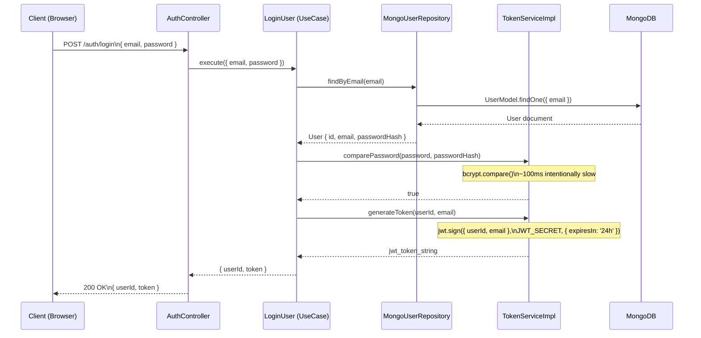
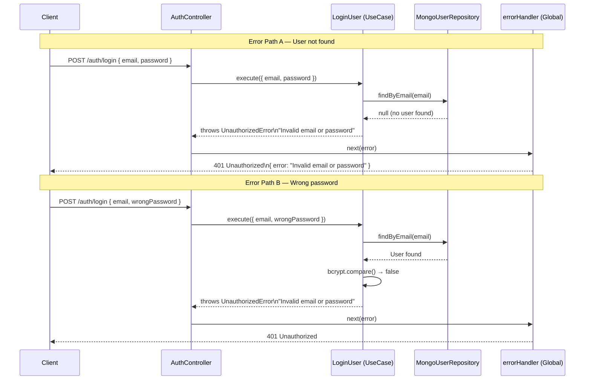
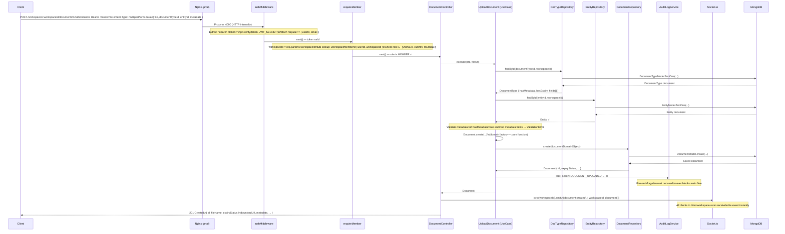
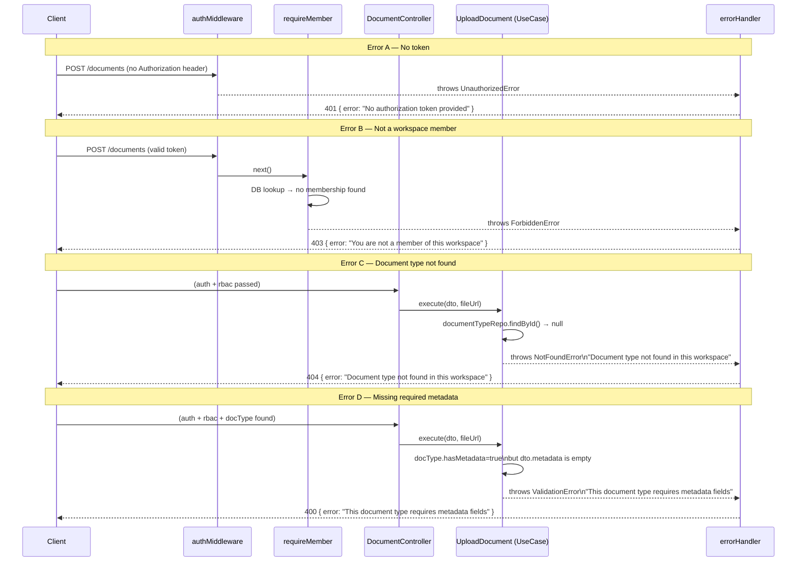
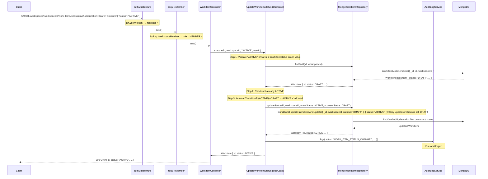
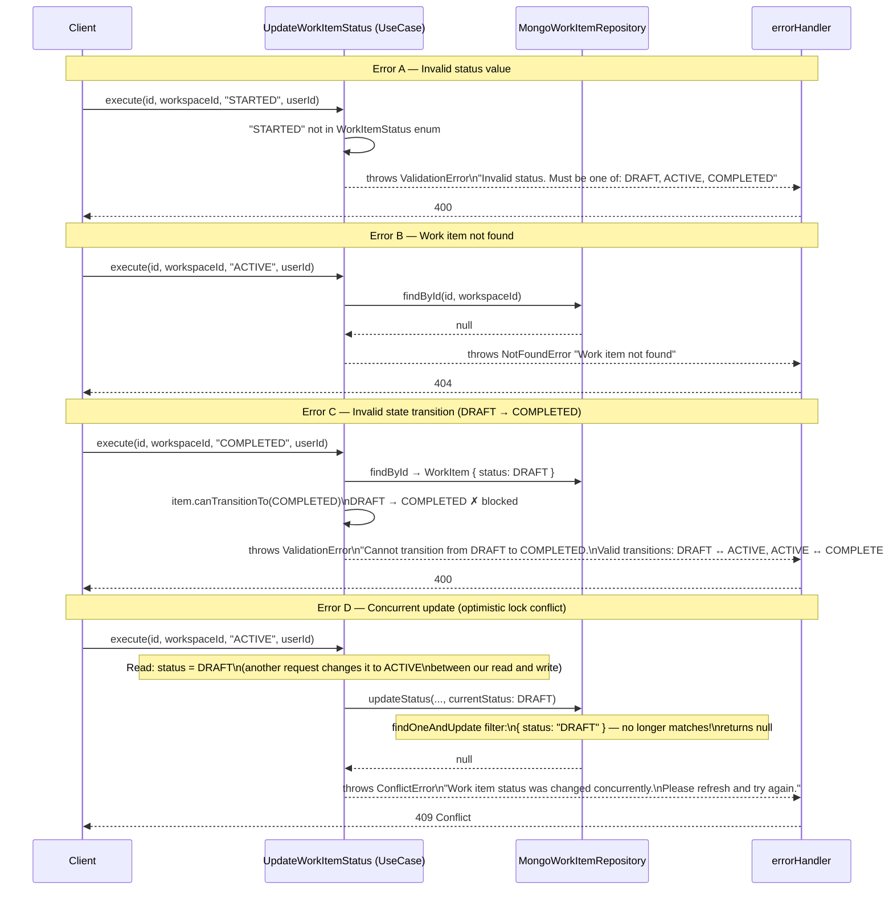

# LLD — Sequence Diagrams

> **Document Type:** Low Level Design — Sequence Diagrams
> **Part of:** LLD (Low Level Design)
> **Related:** [HLD.md](./HLD.md) · [State Machines](./LLD_STATE_MACHINES.md) · [API Documentation](../API_DOCUMENTATION.md)

A **sequence diagram** shows exactly how objects/components communicate with each other **over time**, for a specific scenario. It's the most useful LLD diagram — it forces you to think through every step of a flow including error cases.

Arrows:
- `→` solid: calling a method / sending a request
- `-->` dashed: returning a value / sending a response

---

## Table of Contents

1. [Flow 1 — User Login](#flow-1--user-login-post-authlogin)
2. [Flow 2 — Upload Document](#flow-2--upload-document-post-workspacesworkspaceidocuments)
3. [Flow 3 — Update Work Item Status](#flow-3--update-work-item-status-patch-workspacesworkspaceidwork-itemsidstatus)

---

## Flow 1 — User Login (`POST /auth/login`)

### What this flow covers
A user submits their email and password. The API verifies the credentials, signs a JWT, and returns it. No auth middleware needed — this is a public endpoint.

### Happy Path

### Error Paths

> **Security note:** Both "user not found" and "wrong password" return the exact same error message `"Invalid email or password"`. This is intentional — if you returned "user not found", an attacker could enumerate valid email addresses by trying different emails. Same message = no information leak.

---

## Flow 2 — Upload Document (`POST /workspaces/:workspaceId/documents`)

### What this flow covers
An authenticated MEMBER uploads a document. The request goes through JWT verification, RBAC check, then the use case validates the document type, the entity, the metadata, creates the domain object, persists it, fires an audit log, and returns the result. Socket.io event emitted at the end.

### Happy Path

### Error Paths

---

## Flow 3 — Update Work Item Status (`PATCH /workspaces/:workspaceId/work-items/:id/status`)

### What this flow covers
An authenticated MEMBER changes a work item's status (e.g., DRAFT → ACTIVE). The use case fetches the current state, validates the transition using the domain's `canTransitionTo()` method, does a **conditional update** (optimistic locking) to guard against concurrent changes, then fires the audit log.

### Happy Path

### Error Paths

> **Optimistic Locking explained:** Instead of locking the row before updating (pessimistic), we let multiple requests read freely. When writing, we include the **expected current state** in the WHERE clause: `findOneAndUpdate({ _id, status: "DRAFT" }, { status: "ACTIVE" })`. If another request already changed the status, our filter matches nothing and returns null — we detect the conflict and return 409 instead of silently overwriting.

*LLD Sequence Diagrams — Version 1.0.0 — 2026-03-23*
*For state machine diagrams, see [LLD_STATE_MACHINES.md](./LLD_STATE_MACHINES.md)*