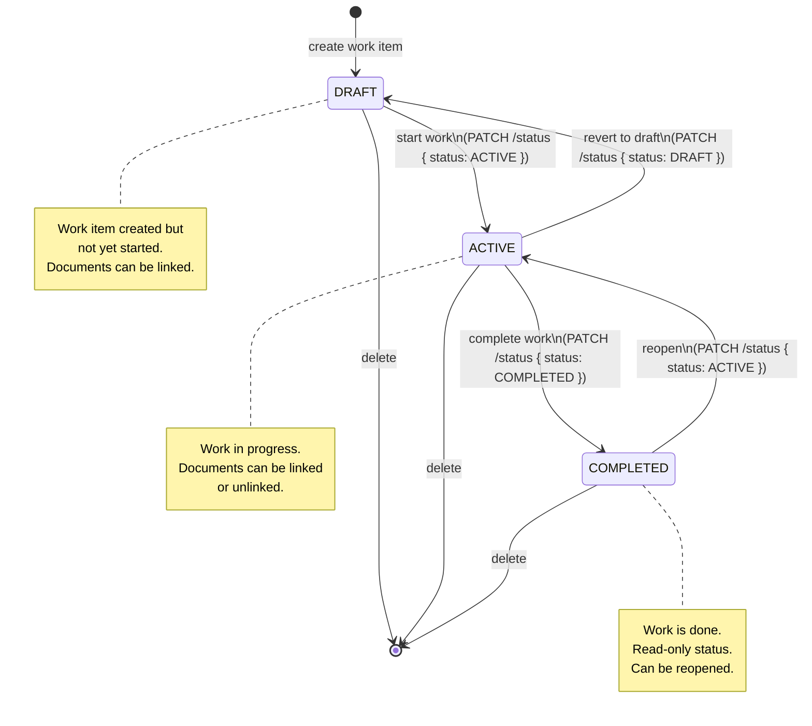
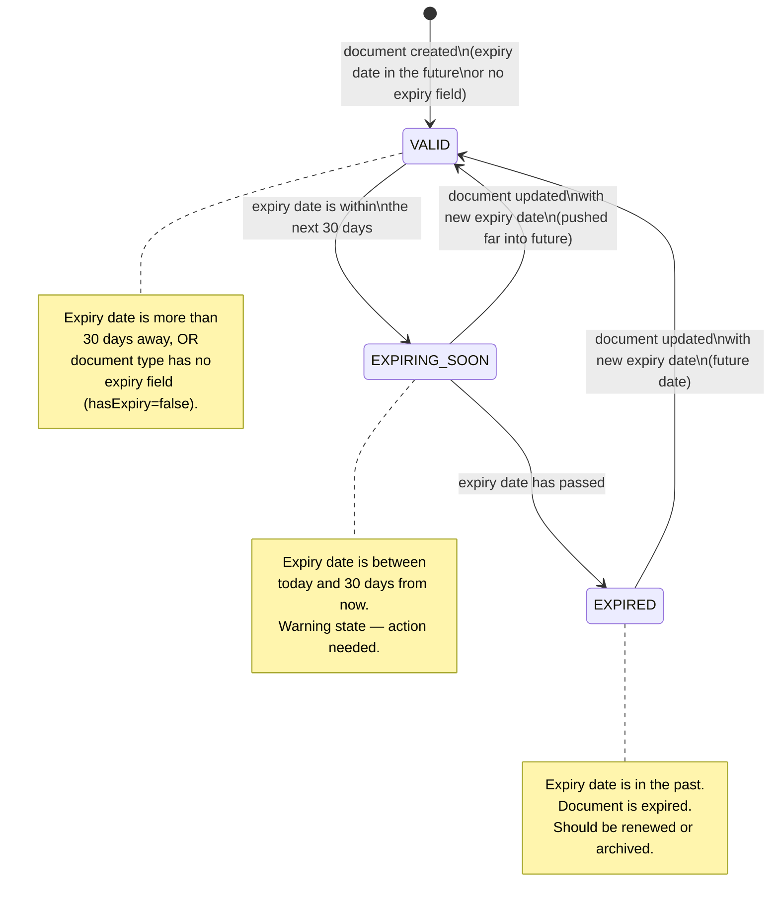
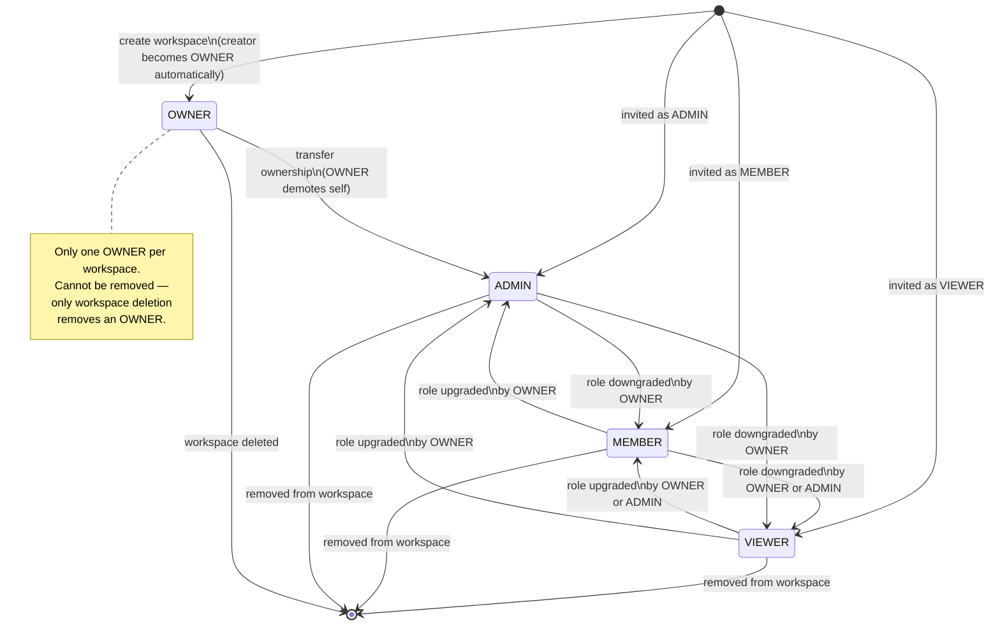

# LLD — State Machine Diagrams

> **Document Type:** Low Level Design — State Machines
> **Part of:** LLD (Low Level Design)
> **Related:** [HLD.md](./HLD.md) · [API Documentation](../API_DOCUMENTATION.md)

A **state machine** defines all the valid **states** an object can be in and the **transitions** (events/actions) that move it between states. It makes business rules explicit and prevents invalid transitions.

---

## Table of Contents

1. [Work Item Status — State Machine](#1-work-item-status--state-machine)
2. [Document Expiry Status — State Machine](#2-document-expiry-status--state-machine)
3. [Workspace Member Role — State Transitions](#3-workspace-member-role--state-transitions)

---

## 1. Work Item Status — State Machine

### What it is
A Work Item is a task or activity tracked within a workspace. It progresses through a lifecycle: it starts as a draft, becomes active when in progress, and is finally completed. The state machine enforces which transitions are valid — you cannot jump directly from DRAFT to COMPLETED.

### Diagram



### Valid Transitions Table

| From | To | Trigger | API Call |
|---|---|---|---|
| *(new)* | **DRAFT** | Work item created | `POST /workspaces/:id/work-items` |
| DRAFT | **ACTIVE** | Work started | `PATCH /work-items/:id/status` `{ "status": "ACTIVE" }` |
| ACTIVE | **DRAFT** | Reverted (needs more planning) | `PATCH /work-items/:id/status` `{ "status": "DRAFT" }` |
| ACTIVE | **COMPLETED** | Work finished | `PATCH /work-items/:id/status` `{ "status": "COMPLETED" }` |
| COMPLETED | **ACTIVE** | Reopened (e.g. feedback received) | `PATCH /work-items/:id/status` `{ "status": "ACTIVE" }` |

### Invalid Transitions (Enforced by Business Rule)

| From | To | Why Invalid |
|---|---|---|
| DRAFT | COMPLETED | Cannot complete work that was never started — must go through ACTIVE |
| COMPLETED | DRAFT | Completed work cannot be reverted all the way back to draft — reopen as ACTIVE first |

### Where This Is Enforced in Code

The transition validation lives in the Use Case layer:
- **File:** `src/modules/work-item/application/use-cases/UpdateWorkItemStatus.ts`
- The use case checks the current status, validates the requested transition against the allowed map, and throws a `ValidationError` if the transition is invalid — before any database write happens.

---

## 2. Document Expiry Status — State Machine

### What it is
A Document has an expiry status that is **computed dynamically** on every read — it is never stored in the database as a field. The computation is based on the document's expiry date (stored in one of its metadata fields that has `isExpiryField: true`) and the current date.

This is different from Work Item status — it is **not triggered by user actions**. It changes automatically as time passes.

### Diagram



### Computation Logic

```
IF document type has hasExpiry = false
    → expiryStatus = "VALID"

ELSE
    expiryDate = value of the field where isExpiryField = true
    daysUntilExpiry = expiryDate - today (in days)

    IF daysUntilExpiry > 30   → "VALID"
    IF 0 < daysUntilExpiry ≤ 30 → "EXPIRING_SOON"
    IF daysUntilExpiry ≤ 0   → "EXPIRED"
```

### Key Business Rules

| Rule | Detail |
|---|---|
| `expiryStatus` is never stored in DB | It is always computed in the repository or use case on read |
| A document type can have `hasExpiry = false` | All its documents are always `VALID` — no expiry tracking |
| If `hasExpiry = true`, at least one field must have `isExpiryField: true` | Enforced at document type creation |
| That field must be `fieldType: "date"` | Enforced at document type creation |

### Where This Is Computed in Code

- **File:** `src/modules/document/infrastructure/repositories/MongoDocumentRepository.ts`
- On every `findById` and `findAll` call, the repository computes `expiryStatus` before returning the document domain object to the use case.

---

## 3. Workspace Member Role — State Transitions

### What it is
A user's role within a workspace can be changed by an OWNER or ADMIN. This is not a lifecycle state machine (there's no final state) — it's a permission level that can be updated at any time.

### Diagram



### Transition Rules

| Who Can Change | Can Promote To | Can Demote To |
|---|---|---|
| OWNER | Any role (ADMIN, MEMBER, VIEWER) | Any role |
| ADMIN | MEMBER, VIEWER (cannot create/promote to ADMIN or OWNER) | MEMBER, VIEWER |
| MEMBER | ❌ Cannot change roles | ❌ Cannot change roles |
| VIEWER | ❌ Cannot change roles | ❌ Cannot change roles |

*LLD State Machines — Version 1.0.0 — 2026-03-23*