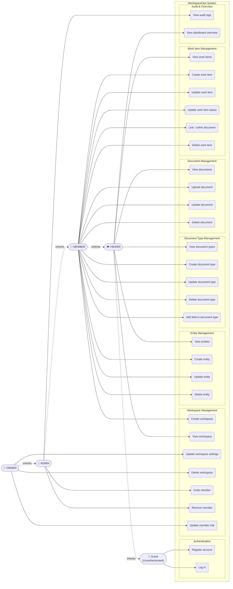

# Use Case Diagram — WorkspaceOps

> **Document Type:** Requirements — Use Case Diagram
> **Related:** [HLD.md](./HLD.md) · [FRD](./FRD%20WorkspaceOps.pdf) · [HLR List](./HLR%20list%20for%20Workspace%20Ops.pdf)

---

## What is a Use Case Diagram?

A **Use Case Diagram** is a UML diagram that answers one question: **"Who can do what in this system?"**

It shows:
- **Actors** — roles that interact with the system (not specific users — roles)
- **Use Cases** — actions the system can perform (verbs)
- **Associations** — which actors can trigger which use cases
- **Generalization** — when one actor inherits all capabilities of another (`OWNER` can do everything `ADMIN` can)
- **System Boundary** — the box that separates what is inside the system from what is outside

Use case diagrams live in the **Requirements phase** of the SDLC. They are the first diagram drawn — before HLD, before LLD. They answer "what does the system do and for whom" before anyone thinks about "how."

---

## Actors

WorkspaceOps has **4 roles** that form a strict hierarchy. Each inherits all capabilities of the role below it.

```
OWNER  ⊃  ADMIN  ⊃  MEMBER  ⊃  VIEWER
```

| Actor | Description |
|---|---|
| **VIEWER** | Read-only access to workspace data |
| **MEMBER** | VIEWER + can create/update/delete entities, documents, work items |
| **ADMIN** | MEMBER + can invite/remove members, manage roles |
| **OWNER** | ADMIN + can delete the workspace, transfer ownership |
| **Guest** | Unauthenticated user — can only register and log in |

---

## Use Case Diagram

> Mermaid renders this diagram in GitHub, VS Code, and Obsidian.
> Actors are on the left. The system boundary is the outer box. Each subgraph is a module.
> Dashed arrows show actor generalization (inheritance).



---

## Actor–Use Case Matrix

A quicker reference — who can do what, at a glance.

| Use Case | Guest | VIEWER | MEMBER | ADMIN | OWNER |
|---|:---:|:---:|:---:|:---:|:---:|
| Register account | ✅ | | | | |
| Log in | ✅ | | | | |
| **Workspace** | | | | | |
| Create workspace | | | ✅ | ✅ | ✅ |
| View workspace | | ✅ | ✅ | ✅ | ✅ |
| Update workspace settings | | | | | ✅ |
| Delete workspace | | | | | ✅ |
| Invite member | | | | ✅ | ✅ |
| Remove member | | | | ✅ | ✅ |
| Update member role | | | | | ✅ |
| **Entity** | | | | | |
| View entities | | ✅ | ✅ | ✅ | ✅ |
| Create / Update / Delete entity | | | ✅ | ✅ | ✅ |
| **Document Type** | | | | | |
| View document types | | ✅ | ✅ | ✅ | ✅ |
| Create / Update / Delete document type | | | ✅ | ✅ | ✅ |
| Add field to document type | | | ✅ | ✅ | ✅ |
| **Document** | | | | | |
| View documents | | ✅ | ✅ | ✅ | ✅ |
| Upload / Update / Delete document | | | ✅ | ✅ | ✅ |
| **Work Item** | | | | | |
| View work items | | ✅ | ✅ | ✅ | ✅ |
| Create / Update / Delete work item | | | ✅ | ✅ | ✅ |
| Update work item status | | | ✅ | ✅ | ✅ |
| Link / unlink document | | | ✅ | ✅ | ✅ |
| **Audit & Overview** | | | | | |
| View audit logs | | | | ✅ | ✅ |
| View dashboard overview | | ✅ | ✅ | ✅ | ✅ |

---

## Key Design Choices Visible in This Diagram

**1. Actor generalization (inheritance)**
OWNER ⊃ ADMIN ⊃ MEMBER ⊃ VIEWER. Every OWNER can do everything an ADMIN can — they are not separate permission sets, they are a hierarchy. This is represented by the `inherits` dashed arrows in the diagram.

**2. Role is workspace-scoped**
The same user can be OWNER in Workspace A and VIEWER in Workspace B. The actor in this diagram represents a *role within a workspace*, not a global user type.

**3. Audit logs are ADMIN+ only**
Audit logs contain sensitive information (who changed what, when). MEMBER and VIEWER cannot access them — only ADMIN and OWNER.

**4. Workspace deletion is OWNER-only**
Creating a workspace makes you OWNER automatically. Only the OWNER can delete it — not even ADMIN. This prevents admins from accidentally or maliciously destroying workspaces.

**5. Guest has no workspace access**
An unauthenticated user can only register or log in. Every other use case requires authentication and workspace membership.

---

*Use Case Diagram — Version 1.0.0 — 2026-03-23*